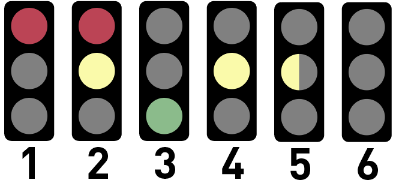

## **Traffic light interactive marker**

## **Installation and startup**

**Installation**

First copy the repository into a catkin workspace, then build it by suing the following commands:

    cd catkin_ws

    catkin build traffic_light
    
    source devel/setup.bash

**Launching**

You need first to start the roscore:

    roscore

Then if you only need 1 traffic_light Marker run:

    rosrun traffic_light traffic_light

If u want more traffic_light Markers you can modify the traffic_light launch file witch add 4 traffic lights.

To change the state of the traffic light you can use run: 
    
    rosrun traffic_light change_state.py

And for multiple traffic lights u can change and use the change_state and pub_state launch files witch ask for a number between 1-6.

To change the position and orientation of the traffic light you can use run: 
    
    rosrun traffic_light place_light.py

And for multiple traffic lights u can change and use the place_light and pub_location launch files witch ask for it's new position in xyz and it's quadric orientation. 

## **Traffic light's states**

## **Input and Output**

**Input**

Traffic light's state  -> Topic(string): /traffic_light_state

Traffic light's position and orientation  -> Topic(geometry_msgs/Pose): /traffic_light_placement

**Output**

Traffic light Marker ->Topic(Marker): /Marker